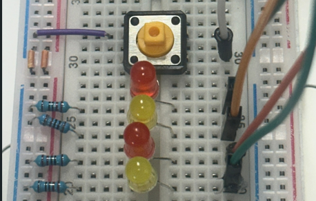
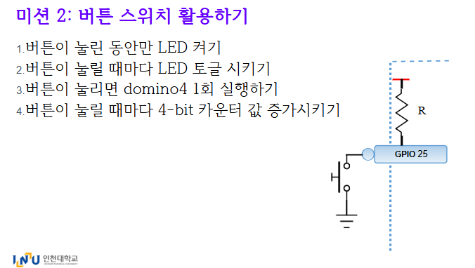

# 💡 임베디드통신 과제 - GPIOZERO을 사용해서 LED, BUTTON 제어하기

> GPIO 제어를 위한 Python 라이브러리인 **gpiozero**를 사용하여  
> 간단하고 직관적으로 버튼 입력과 LED 출력을 구현했습니다.

---

## 🎬 실행 영상

[](https://youtu.be/gP-BqoA3K5k)

> 위 이미지를 클릭하면 실행 영상을 확인할 수 있습니다.

---

## 🖼️ 미션 설명 사진



---

## 🧪 실습 목록

1. **LED_ON**  
   버튼을 누르고 있는 동안 모든 LED가 켜지는 동작

2. **LED_toggle**  
   버튼을 한 번 누를 때마다 LED가 ON/OFF 토글되는 동작

3. **LED_domino**  
   버튼을 누르면 LED가 순서대로 차례로 켜졌다 꺼지는 도미노 효과

4. **LED_counter**  
   버튼을 누르면 LED가 0~15까지 이진수로 카운트되며 출력됨

---

## ⚙️ 핀 설정

```python
from gpiozero import Button, LED

# 버튼: GPIO 25번 핀, 풀업 입력으로 설정
button = Button(25, pull_up=True)

# LED: GPIO 8, 7, 16, 20번 핀 사용 (bit0 ~ bit3)
led_pins = [8, 7, 16, 20]
leds = [LED(pin) for pin in led_pins]
