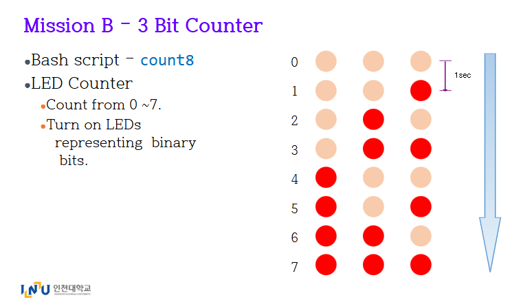
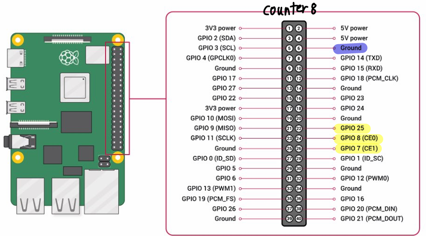
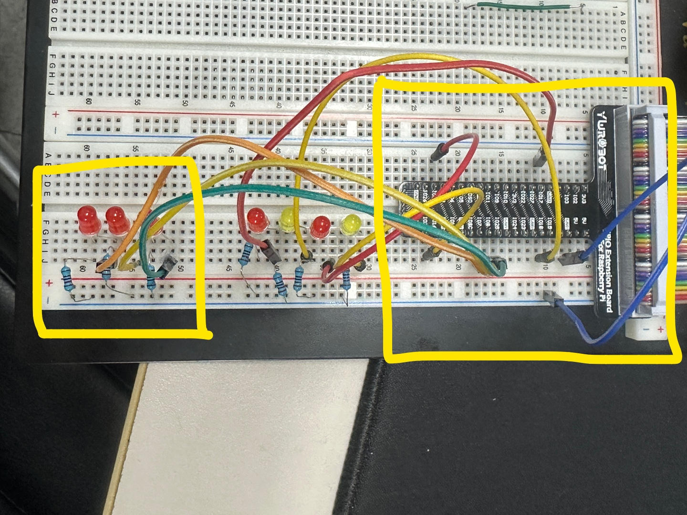

# [임베디드 통신 - 과제 counter] - RaspberryPI5, GPIO, LED 활용하기2
## 📌 프로젝트 개요

이 프로젝트는 Raspberry Pi의 3개 GPIO 핀에 연결된 LED들을 **자연스럽게 0~7까지 이진수 카운팅이 구현** 하는 Bash 스크립트입니다.

3개의 LED를 **2⁰, 2¹, 2²의 주기로 병렬 깜빡이게 하여 카운팅**합니다.
- 각 LED는 아래와 같은 주기로 깜빡입니다:
  - **LED1 (GPIO7):** 1초 ON → 1초 OFF
  - **LED2 (GPIO8):** 2초 ON → 2초 OFF
  - **LED3 (GPIO25):** 4초 ON → 4초 OFF
- 각 LED는 **동시에 독립적으로 동작**하며, 전체 흐름은 **병렬 실행**(`&`)을 통해 구현됩니다.

## 🎥 실행 영상 - 클릭해보세요!

## 🔧 회로 구성

- LED의 **양극(+)** 은 해당 GPIO 핀에 연결합니다.
- LED의 **음극(-)** 은 **저항** 을 거쳐 Raspberry Pi의 **GND 핀**에 연결합니다.

### ✅ 핀 연결표

| LED 번호 | GPIO 핀 번호 | Raspberry Pi Physical 핀 번호 | 비고              |
|----------|---------------|-------------------------------|-------------------|
| LED1     | GPIO7         | 26번                          | 핀1 양극(+) 연결   |
| LED2     | GPIO8         | 24번                          | 핀2 양극(+) 연결   |
| LED3     | GPIO25        | 22번                          | 핀3 양극(+) 연결   |

> 모든 LED의 음극은 저항을 통해 Raspberry Pi의 GND(6번 핀 등)에 연결합니다.

---

## ⚙️ 실행 방식

1. 각 GPIO 핀을 **출력 모드(op)** 로 설정합니다.
2. `blink_LED()` 함수는 핀 번호와 시간 지연을 받아,
   - 지정한 핀을 1회 OFF(dl) → delay
   - 다시 ON(dh) → delay
   - 위 과정을 **무한 반복**합니다.
3. `blink_LED`를 각 LED마다 **다른 delay**로 백그라운드에서 실행합니다 (`&` 사용).
4. `wait` 명령어로 스크립트가 종료되지 않도록 유지합니다.

---

## 🔧 함수 설명

- `blink_LED(pin, delay)` :
  - 지정한 GPIO 핀을 **delay 간격으로 OFF → ON** 반복
  - `pinctrl set $pin dl` → 끄기
  - `pinctrl set $pin dh` → 켜기

---

## 🖼️ 회로 구성도

