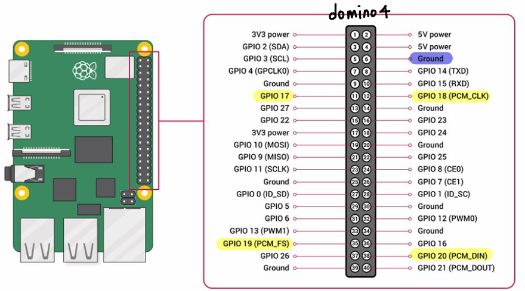
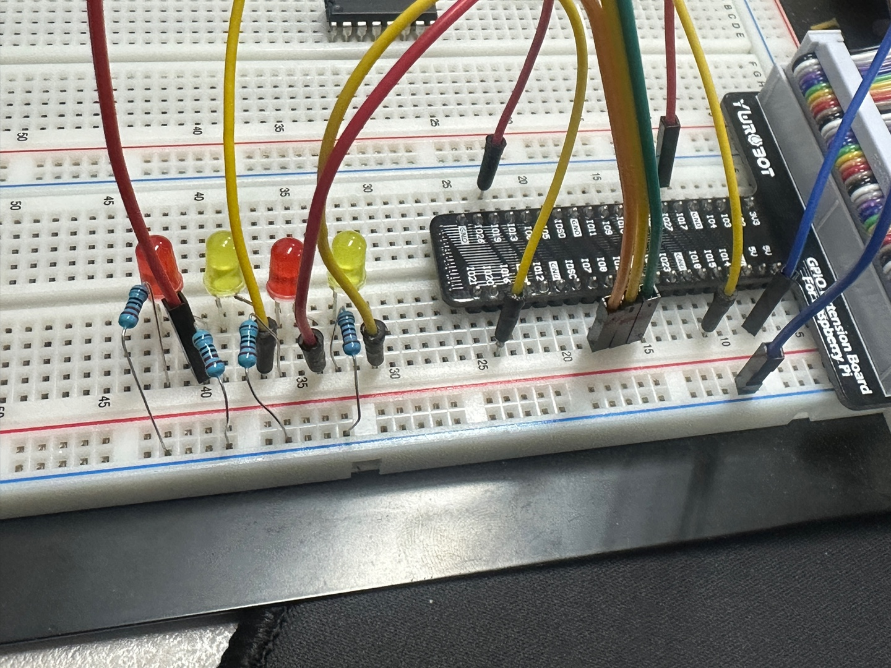

# [임베디드 통신 - Domino] - RaspberryPI5, GPIO, LED 활용하기 1 

## 📌 프로젝트 개요

이 프로젝트는 Raspberry Pi5의 GPIO 핀 4개를 이용하여 LED 4개를 **1초 간격으로 순차 점등**하는 Bash 스크립트입니다.

- 1번 LED → 2번 LED → 3번 LED → 4번 LED 순서로 켜졌다 꺼집니다.
- 각 LED는 1초 동안 켜진 후 꺼지고, 다음 LED로 넘어갑니다.
- 이 과정을 무한 반복합니다.

---

## 🎥 실행 영상

## 🔧 회로 구성

- LED의 **양극(긴 다리, +)** 은 Raspberry Pi의 GPIO 핀에 연결됩니다.
- LED의 **음극(짧은 다리, -)** 은 **저항** 을 거쳐 **GND**에 연결됩니다.

### ✅ 핀 연결표

| LED 번호 | GPIO 핀 번호 | Raspberry Pi Physical 핀 번호 | 비고            |
|----------|---------------|-------------------------------|-----------------|
| LED1     | GPIO17        | 11번                          | 핀1의 양극(+) 연결 |
| LED2     | GPIO18        | 12번                          | 핀2의 양극(+) 연결 |
| LED3     | GPIO19        | 35번                          | 핀3의 양극(+) 연결 |
| LED4     | GPIO20        | 38번                          | 핀4의 양극(+) 연결 |

> 저항은 각 LED의 **음극(-)** 쪽에 직렬로 연결하여 **Raspberry Pi의 GND(6번 핀)** 으으로 연결합니다.

---

## ⚙️ 실행 방식

1. 스크립트 실행 시, 먼저 4개의 GPIO 핀을 **출력 모드(op)** 로 설정합니다.
2. 모든 LED를 **OFF(dl)** 상태로 초기화합니다.
3. 무한 루프를 돌며 `1초 간격으로 LED를 순서대로 ON/OFF` 합니다.
4. 전체 흐름은 아래 함수들로 제어됩니다:
   - `TurnOnOneLED(n)` : **n번째 LED를 켭니다** (GPIO 핀에 `dh` → high 전압 출력)
   - `TurnOffOneLED(n)` : **n번째 LED를 끕니다** (GPIO 핀에 `dl` → low 전압 출력)

---

## 🖼️ 회로 이미지

