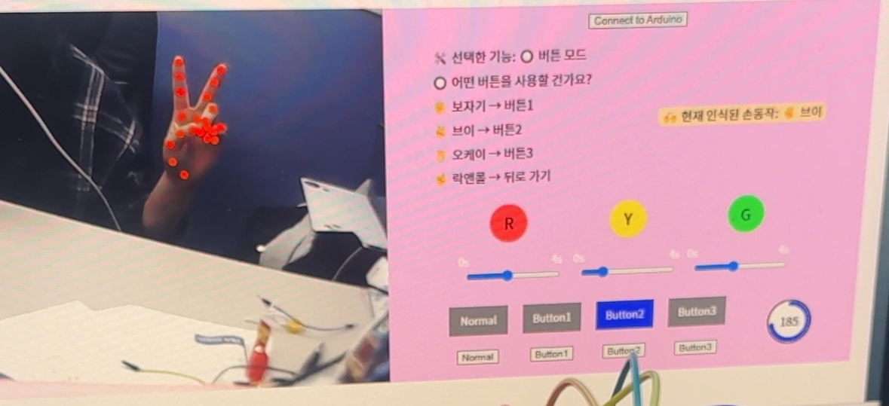
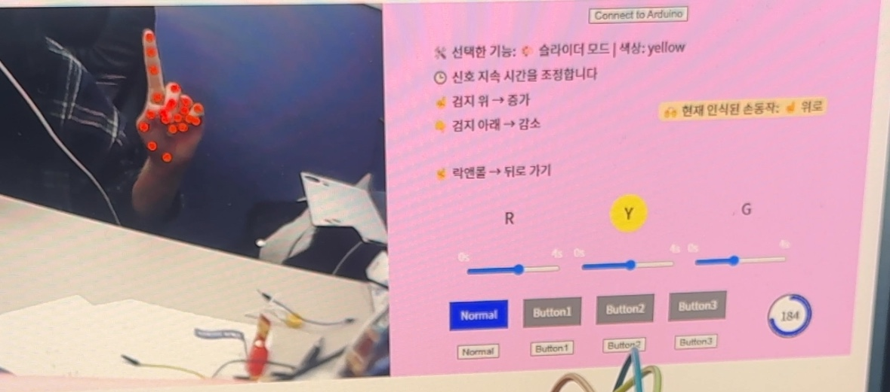
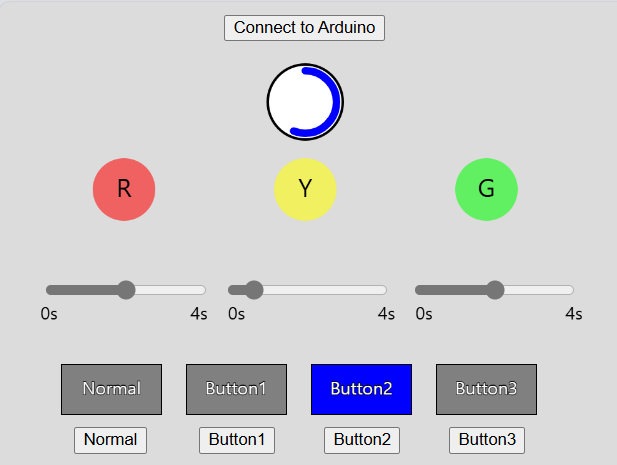
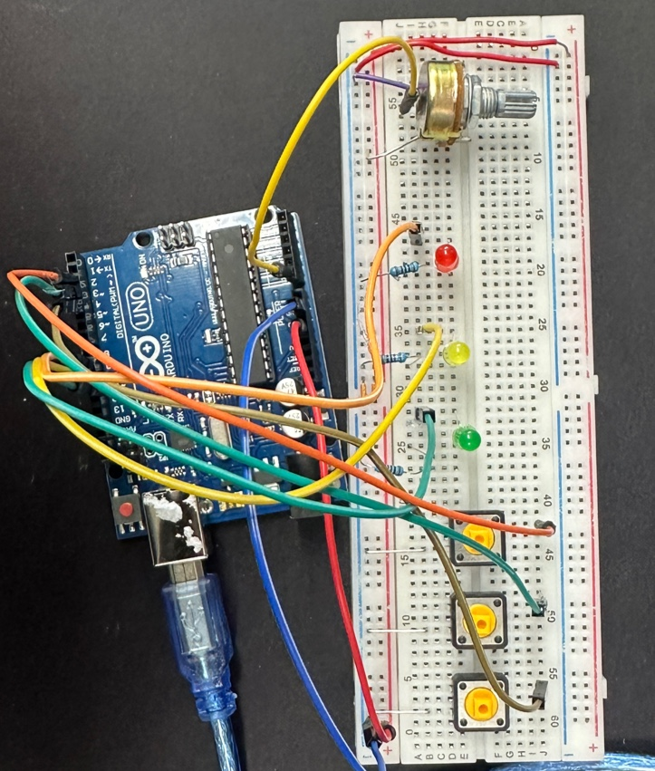

# 🚦 [임베디드통신 - 2차 과제] 핸드포즈로 신호등 제어하기

### 📌 개요
기존 아두이노 LED 신호 제어 시스템에 **손동작(핸드포즈)** 기반 UI를 추가하여,  
**마우스나 키보드 없이도** 체스처로도 LED 신호등을 단계별 제어할 수 있게 만든 프로젝트입니다.

참고 사항: 아두이노 코드는 변경 사항이 없고 UI 디자인 코드에 변경사항이 있습니다.

---
## 📷 **시연 영상**

## 💡 핵심 기능

| 기능 | 설명 |
|------|------|
| ✋ 핸드포즈 기반 UI 제어 | 손 제스처만으로 선택/조작 가능 |
| 🤖 단계별 질문 인터페이스 | 선택지 형태의 질문 UI와 연동된 제스처 선택 시스템 |
| 🎨 슬라이더 → 제스처 치환 | 기존의 밝기 슬라이더 조정을 제스처로도 가능 |
| 🔄 동기화된 제어 방식 | 버튼 클릭/제스처 입력 모두 동일하게 작동되도록 완벽 동기화 |
| ↩️ 락앤롤 포즈로 '뒤로가기' | 언제든 손동작으로 이전 단계로 이동 가능 |
| 🖐️ 양손 지원(각 손마다 독립) | 좌우 손 제스처 모두 인식 → 편의성 향상 |
| 🔁 프레임 간 변화 감지 기반 작동 | 손 제스처를 유지하더라도, 처음 인식된 순간에만 한 번만 동작하도록 구현 (오작동 방지) |
| 🎯 LED 사이클 제어 | 3가지 LED 밝기를 제스처로 직접 조정 가능 |

---

## 🧠 시스템 흐름

1. 🤖 질문이 UI에 표시됨
2. ✋ 사용자가 해당 질문에 맞는 손 제스처로 응답
3. ✅ 선택된 항목에 배경 강조
4. 🔄 슬라이더 조정, 색상 선택 등 모든 제어가 제스처로 수행
5. 🤘 락앤롤 포즈로 언제든 이전 단계로 복귀 가능

---

## ✋ 제스처 매핑 패턴

| 제스처 | 기능 설명 | 적용 단계 |
|--------|-----------|------------|
| 🖐️ 보자기 | 버튼 모드 선택 / 버튼1 / 빨강 선택 | 기능 / 버튼 / 색상 |
| ✌️ 브이 | 슬라이더 모드 선택 / 버튼2 / 노랑 선택 | 기능 / 버튼 / 색상 |
| 👌 오케이 | 버튼3 / 초록 선택 | 버튼 / 색상 |
| ☝️ 검지 위 | 슬라이더 값 증가 | 신호 지속 시간 조절 |
| 👇 검지 아래 | 슬라이더 값 감소 | 신호 지속 시간 조절 |
| 🤘 락앤롤 | 뒤로 가기 | 모든 단계에서 사용 가능 |

---

## 📷 UI 시연 이미지

- 화면에는 **질문과 선택지**가 순서대로 출력됨  
- 선택한 항목은 배경 강조로 시각적 피드백 제공  
- 우측 상단에는 **현재 인식된 손동작 이모지**가 출력되어 실시간 반응 확인 가능

### 🖼 **웹 UI**

---
---
# 🚦 [임베디드통신 - 1차 과제] 신호등 제어 시스템 (Arduino + p5.js)

이 프로젝트는 **아두이노(Arduino)와 p5.js를 활용하여 신호등을 제어**하는 시스템입니다.  
사용자는 **버튼 입력 및 웹 인터페이스를 통해 신호등을 조작**할 수 있으며,  
LED 밝기 및 지속 시간을 조절할 수 있습니다.

---
## 📷 **시연 영상**

## 🛠 **기능 구현**
### ✅ 1. **실시간 LED 상태 표시 (Arduino → p5.js)**
- 아두이노에서 **각 LED(Red, Yellow, Green)의 상태**를 p5.js에 실시간 전송
- 가변저항(Potentiometer) 값을 읽어 LED **밝기를 조절**
- p5.js에서는 **투명도(alpha 값)를 이용하여 LED 밝기 표현**

### ✅ 2. **LED 지속 시간 조절 (p5.js → Arduino)**
- 웹에서 **슬라이더**를 사용하여 **각 LED(빨강, 노랑, 초록)의 지속 시간(0~4초)** 설정 가능
- 설정된 값은 **시리얼 통신을 통해 아두이노에 전송**
- 아두이노에서 **전달받은 지속 시간에 따라 LED 점등 시간 변경**

### ✅ 3. **신호등 모드 변경 (Arduino ↔ p5.js)**
- 아두이노 버튼 또는 **p5.js의 버튼 UI를 통해 신호등 모드 변경**
- 총 **4가지 모드 지원**  
  - **Normal Mode (기본 신호등 동작)**
  - **Button 1 Mode (빨간불 고정)**
  - **Button 2 Mode (모든 LED 깜빡임)**
  - **Button 3 Mode (LED OFF)**
- p5.js에서 **모드 버튼 클릭 시 Arduino에도 실시간 반영 (양방향 통신)**

### ✅ 4. **신호등 밝기 인디케이터 (Arduino → p5.js)**
- 가변저항(Potentiometer) 값(0~1023)을 0~255로 매핑하여 **LED 밝기 조절**
- p5.js에서 **원형 게이지(arc)를 사용하여 밝기 표시**
- 사용자가 가변저항을 조작하면 **실시간으로 밝기 게이지 업데이트**

### ✅ 5. **p5.js에서 신호등 모드 버튼을 두 번 클릭하면 원래 상태로 복귀**
- 아두이노처럼 **모드 버튼을 다시 누르면 원래 상태(Normal)로 복귀**하는 기능 구현
- **토글 방식 지원**
  - 첫 번째 클릭: 해당 모드 활성화
  - 두 번째 클릭: 원래 상태 (Normal)로 복귀

---

## 🔗 **사용 기술**
### ✅ **하드웨어**
- **Arduino Uno**  
- **LED x3 (빨강, 노랑, 초록)**  
- **푸시 버튼 x3**  
- **가변저항 (Potentiometer) x1**  
- **저항 (330Ω ~ 1kΩ) x3**  
- **브레드보드 & 점퍼 와이어**  

### ✅ **소프트웨어**
- **Arduino C++ (TaskScheduler 활용)**
- **p5.js (Web Serial API 사용)**
- **HTML / JavaScript**

---

## 📌 **회로 구성**
### **📍 핀 연결**
| 부품 | 아두이노 핀 번호 |
|------|--------------|
| **버튼 1 (Button1)** | `D2` |
| **버튼 2 (Button2)** | `D3` |
| **버튼 3 (Button3)** | `D4` |
| **빨간 LED (Red LED)** | `D9` |
| **노란 LED (Yellow LED)** | `D10` |
| **초록 LED (Green LED)** | `D11` |
| **가변저항 (Potentiometer)** | `A0` (아날로그 입력) |

### **📍 하드웨어 연결**
#### 🟢 **가변저항 (Potentiometer)**
- **왼쪽 핀** → `GND` 연결  
- **오른쪽 핀** → `5V` 연결  
- **가운데 핀** → `A0` (아날로그 입력) 연결

#### 🟢 **LED (Red, Yellow, Green)**
- **LED (+) 핀** → 아두이노 `D9`, `D10`, `D11` 연결  
- **LED (-) 핀** → **330Ω ~ 1kΩ 저항을 거쳐 GND 연결**

#### 🟢 **버튼 (Push Button)**
- **버튼의 한쪽(+)** → `D2, D3, D4` (각 버튼별)  
- **버튼의 반대쪽(-)** → `GND` 연결

#### 🟢 **전원**
- **아두이노 `5V`** → 회로 내 부품(가변저항, 버튼, 센서 등)에 전원 공급  
- **아두이노 `GND`** → 모든 부품과 연결하여 회로 완성  

---

## 📷 **시연 이미지**

### 🖼 **웹 UI**

### 🖼 **회로도**

